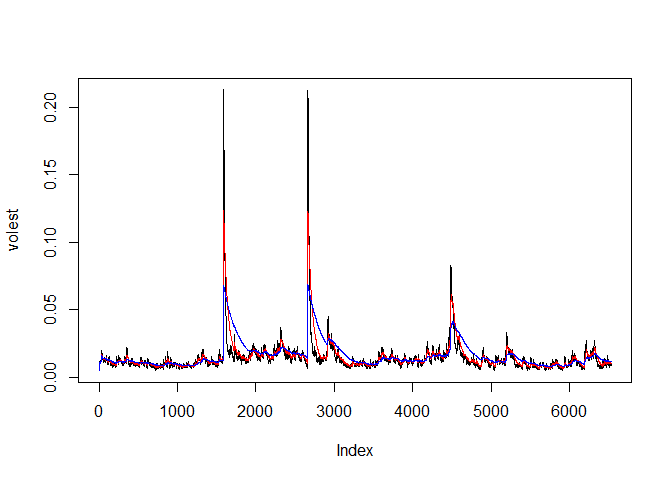
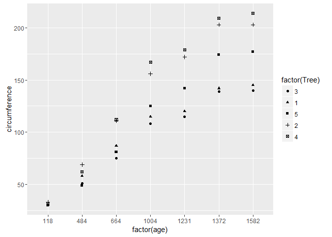
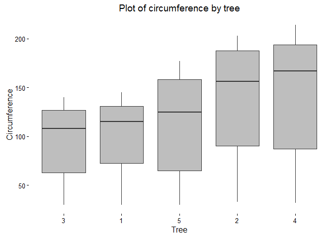
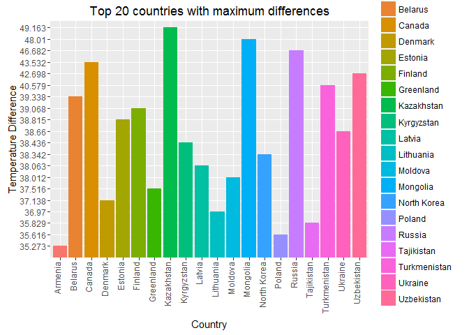
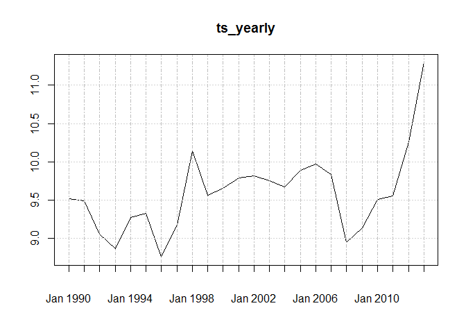
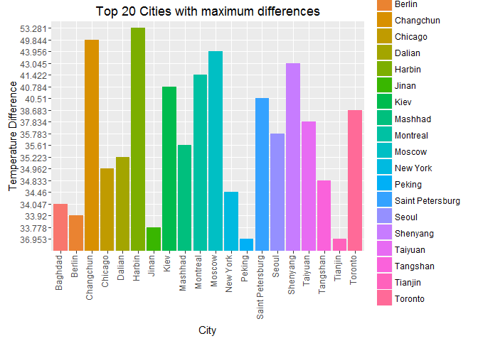
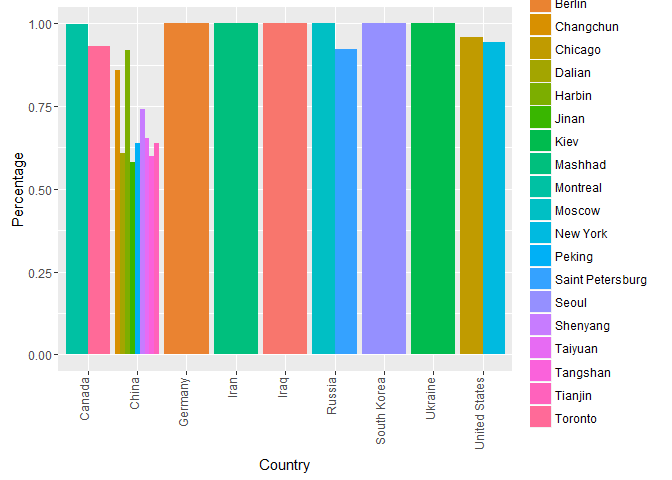

# CaseStudy2
Vishi Cline  
November 22, 2016  


```r
knitr::opts_chunk$set(echo = TRUE)
```

<u>Install Packages</u>

```
## Warning: package 'tseries' was built under R version 3.2.5
```

```
## Warning: package 'ggplot2' was built under R version 3.2.5
```

```
## Warning: package 'xts' was built under R version 3.2.5
```

```
## Loading required package: zoo
```

```
## Warning: package 'zoo' was built under R version 3.2.5
```

```
## 
## Attaching package: 'zoo'
```

```
## The following objects are masked from 'package:base':
## 
##     as.Date, as.Date.numeric
```

<b>Create the X matrix and print it from SAS, R, and Python.</b>

<u>SAS code</u>

proc iml;
reset print;
X= {4 5 1 2 , 1 0 3 5 , 2 1 8 2  };
quit;  

<u>Python Code</u>

import numpy  
x = numpy.matrix([[4,5,1,2], [1,0,3,5],[2,1,8,2]])  
print(x)  


<u>R code</u>

```r
X <- matrix( 
c(4,5,1,2,1,0,3,5,2,1,8,2), # the data elements 
nrow=3,              # number of rows 
ncol=4,              # number of columns 
byrow = TRUE)
print(X)
```

```
##      [,1] [,2] [,3] [,4]
## [1,]    4    5    1    2
## [2,]    1    0    3    5
## [3,]    2    1    8    2
```

<b>For XOM, do the following:

* Download the data.
*	Calculate log returns.
*	Calculate volatility measure.
*	Calculate volatility over entire length of series for the different decay factors.
*	Plot the results, overlaying the volatility curves on the data, just as was done in the S&P example.</b>

<u>Download Data</u>  
Download the data for stocks relating to TC Pilpelines.

```r
SNPdata<-get.hist.quote(instrument = 'XOM',quote="Close")
```

```
## Warning in download.file(url, destfile, method = method, quiet = quiet):
## downloaded length 407502 != reported length 200
```

```
## time series ends   2016-12-02
```

```r
length(SNPdata)
```

```
## [1] 6533
```

<u>Calculate Log Returns</u>  
We used log return as opposed to percent return because log returns are symmetric with respect to gains and losses. They are also additive.

```r
SNPret<-log(lag(SNPdata))-log(SNPdata)
length(SNPret)
```

```
## [1] 6532
```

<u>Calculate Volatility measure</u>  
Get the running estimate of how much change has occured using sample standard deviation.

```r
SNPvol<-sd(SNPret) * sqrt(250)*100
SNPvol
```

```
## [1] 29.91664
```

<u>Calculate volatility and a continuous lookback window using various decay factors.</u>  
The following function exponentially downweights the older data. It calculates the variance as the weighted sum of squares of the previous returns and then takes the square root to estimate the volatility.

```r
Vol<-function(d,logrets){
  var=0
  lam=0
  varlist<-c()
  for (r in logrets){
    lam=lam*(1-1/d)+1
    var=(1-1/lam)*var+(1/lam)*r^2
    varlist<-c(varlist,var)
  }
  sqrt(varlist)
}

#volatility with different weights
volest<-Vol(10, SNPret)
volest2<-Vol(30, SNPret)
volest3<-Vol(100, SNPret)
```

<u>Plot the results</u>

```r
plot(volest, type="l")
lines(volest2, type="l", col="red")
lines(volest3, type="l", col="blue")
```

<!-- -->

<u>Interpret the results</u>
THe following financial stock analysis is for Exxon Mobil Corp.  There are a total of 6530 records, around 26 years old.  Based on the volatility (29.92), the data is not very volatile and pretty stable.  There are no evident patterns but there are 2 large spikes and 1 medium spike in the plot.  

<b>The built-in data set called Orange in R is about the growth of orange trees. The Orange data frame has 3 columns of records of the growth of orange trees.
Variable description
Tree : an ordered factor indicating the tree on which the measurement is made. The ordering is according to increasing maximum diameter.

age :  a numeric vector giving the age of the tree (days since 1968/12/31)
circumference :  a numeric vector of trunk circumferences (mm). This is probably "circumference at breast height", a standard measurement in forestry.</b>

a)	Calculate the mean and the median of the trunk circumferences for different size of the trees. (Tree)

```r
tapply(Orange$circumference, Orange$Tree, mean)
```

```
##         3         1         5         2         4 
##  94.00000  99.57143 111.14286 135.28571 139.28571
```

```r
tapply(Orange$circumference, Orange$Tree, median)
```

```
##   3   1   5   2   4 
## 108 115 125 156 167
```

b)	Make a scatter plot of the trunk circumferences against the age of the tree. Use different plotting symbols for different size of trees.

```r
ggplot(Orange, aes(x=factor(age), y=circumference, shape=factor(Tree))) + geom_point()
```

<!-- -->

c)	Display the trunk circumferences on a comparative boxplot against tree. Be sure you order the boxplots in the increasing order of maximum diameter.

```r
NewOrange<-Orange
NewOrange$Diameter<-(NewOrange$circumference/pi)
NewOrange<-NewOrange[order(NewOrange$Diameter), ]
ggplot(NewOrange, aes(x=factor(Tree), y=circumference))+geom_boxplot(fill="gray")+
  labs(title="Plot of circumference by tree",x="Tree", y = "Circumference")+
  theme_classic()
```

<!-- -->

Using the "Temp" data set:  
(i)	Find the difference between the maximum and the minimum monthly average temperatures for each country and report/visualize top 20 countries with the maximum differences for the period since 1900.

```r
#Download data
temps<-read.csv("C:/Homework/R/caseStudy2/Temp.csv", stringsAsFactors = FALSE, header = TRUE)

#Replace all blanks with NA's
temps[temps==""] <- NA

#Remove NA's from Date and AverageTemp columns
temps <- temps[!is.na(temps$Date),]
temps <- temps[!is.na(temps$Monthly.AverageTemp),]

#Convert the dates to a consistent format
dmy <- as.Date(temps$Date,format="%d/%m/%Y")
ydm <- as.Date(temps$Date,format="%Y-%d-%m") 
dmy[is.na(dmy)] <- ydm[!is.na(ydm)] 
temps$Date <- dmy

#Filter data for period>=1900
ds1900<-subset(temps, (temps$Date>="1900-01-01"))

#Get the min and max average temps by Country
minTemps<-aggregate(Monthly.AverageTemp~Country,ds1900,min)
maxTemps<-aggregate(Monthly.AverageTemp~Country,ds1900,max)

#Merge the data by Country
MergedData<-merge(minTemps,maxTemps, by=c("Country"))

#Calculate the diff between the maximum and minimum monthly average temperatures.
MergedData$Diff<-MergedData$Monthly.AverageTemp.y-MergedData$Monthly.AverageTemp.x

#Report top 20 countries with maximum average differences
top20<-head(MergedData[order(-MergedData[,4]),],20)
print(top20[,c("Country","Diff")])
```

```
##          Country   Diff
## 115   Kazakhstan 49.163
## 144     Mongolia 48.010
## 180       Russia 46.682
## 40        Canada 43.532
## 234   Uzbekistan 42.698
## 225 Turkmenistan 40.579
## 22       Belarus 39.338
## 75       Finland 39.068
## 68       Estonia 38.815
## 228      Ukraine 38.660
## 120   Kyrgyzstan 38.436
## 160  North Korea 38.342
## 122       Latvia 38.063
## 142      Moldova 38.012
## 88     Greenland 37.516
## 58       Denmark 37.138
## 128    Lithuania 36.970
## 216   Tajikistan 35.829
## 174       Poland 35.616
## 11       Armenia 35.273
```

```r
#visualize top 20 countries with maximum average differences
ggplot(top20, aes(x = factor(Country), y = reorder(Diff,Diff,function(y)-length(y)), fill=factor(Country))) + geom_bar(stat = "identity")+
  theme(axis.text.x=element_text(angle=90,hjust=1,vjust=0.05))+
  xlab("Country") +
  ylab("Temperature Difference")+
  labs(fill="Country")+
  ggtitle("Top 20 countries with maximum differences")
```

<!-- -->

(ii)	Select a subset of data and call it "UStemp" for US land temperatures starting from 01/01/1990 in Temp data. Use UStemp dataset to answer the following:

```r
UStemp1990<-subset(temps, (temps$Date>="1990-01-01"))
UStemp<-subset(UStemp1990, (UStemp1990$Country=="United States"))
```

a)	Create a new column to display the monthly average land temperatures in Fahrenheit (?F).

```r
UStemp$Fahrenheit<-((UStemp$Monthly.AverageTemp*1.8000)+32.00)
```

b)	Calculate average land temperature by year and plot it. The original file has the average land temperature by month. 

```r
ts <- xts(UStemp$Monthly.AverageTemp, UStemp$Date)
ts_yearly = apply.yearly(ts,mean)
ts_yearly
```

```
##                 [,1]
## 1990-01-12  9.521583
## 1991-01-12  9.493667
## 1992-01-12  9.056333
## 1993-01-12  8.867250
## 1994-01-12  9.270333
## 1995-01-12  9.331000
## 1996-01-12  8.754333
## 1997-01-12  9.172917
## 1998-01-12 10.141167
## 1999-01-12  9.567000
## 2000-01-12  9.649750
## 2001-01-12  9.785583
## 2002-01-12  9.816167
## 2003-01-12  9.755083
## 2004-01-12  9.667500
## 2005-01-12  9.892667
## 2006-01-12  9.974500
## 2007-01-12  9.837500
## 2008-01-12  8.951417
## 2009-01-12  9.137083
## 2010-01-12  9.505583
## 2011-01-12  9.549917
## 2012-01-12 10.261083
## 2013-01-09 11.297111
```

```r
plot(ts_yearly)
```

<!-- -->

c)	Calculate the one year difference of average land temperature by year and provide the maximum difference (value) with corresponding two years.

```r
OneYearDiff<-apply(ts_yearly,2,diff) 
print(OneYearDiff)
```

```
##                   [,1]
## 1991-01-12 -0.02791667
## 1992-01-12 -0.43733333
## 1993-01-12 -0.18908333
## 1994-01-12  0.40308333
## 1995-01-12  0.06066667
## 1996-01-12 -0.57666667
## 1997-01-12  0.41858333
## 1998-01-12  0.96825000
## 1999-01-12 -0.57416667
## 2000-01-12  0.08275000
## 2001-01-12  0.13583333
## 2002-01-12  0.03058333
## 2003-01-12 -0.06108333
## 2004-01-12 -0.08758333
## 2005-01-12  0.22516667
## 2006-01-12  0.08183333
## 2007-01-12 -0.13700000
## 2008-01-12 -0.88608333
## 2009-01-12  0.18566667
## 2010-01-12  0.36850000
## 2011-01-12  0.04433333
## 2012-01-12  0.71116667
## 2013-01-09  1.03602778
```

```r
period.apply(OneYearDiff,INDEX=endpoints(OneYearDiff), FUN=max)
```

```
##                [,1]
## 2013-01-09 1.036028
```

(iii)	Using the "CityTemp" data set:  
a.	Find the difference between the maximum and the minimum temperatures for each major city and report/visualize top 20 cities with maximum differences for the period since 1900. 

```r
tempsCity<-read.csv("C:/Homework/R/caseStudy2/CityTemp.csv", stringsAsFactors = FALSE, header = TRUE)

#Replace all blanks with NA's
tempsCity[tempsCity==""] <- NA

#Remove NA's from Date and AverageTemp columns
tempsCity <- tempsCity[!is.na(tempsCity$Date),]
tempsCity <- tempsCity[!is.na(tempsCity$Monthly.AverageTemp),]

#Convert the dates to a consistent format
dmyCity <- as.Date(tempsCity$Date,format="%d/%m/%Y")
ydmCity <- as.Date(tempsCity$Date,format="%Y-%d-%m") 
dmyCity[is.na(dmyCity)] <- ydmCity[!is.na(ydmCity)] 
tempsCity$Date <- dmyCity 

#Filter data for period>=1900
ds1900tempsCity<-subset(tempsCity, (tempsCity$Date>="1900-01-01"))

#Get the min and max average temps by City
mintempsCity<-aggregate(Monthly.AverageTemp~City,ds1900tempsCity,min)
maxtempsCity<-aggregate(Monthly.AverageTemp~City,ds1900tempsCity,max)

#Merge the data by City
MergedDatatempsCity<-merge(mintempsCity,maxtempsCity, by=c("City"))

#Calculate the diff between the maximum and minimum monthly average temperatures.
MergedDatatempsCity$Diff<-MergedDatatempsCity$Monthly.AverageTemp.y-MergedDatatempsCity$Monthly.AverageTemp.x

#Report top 20 cities with maximum average differences
top20tempsCity<-head(MergedDatatempsCity[order(-MergedDatatempsCity[,4]),],20)
print(top20tempsCity[,c("City","Diff")])
```

```
##                City   Diff
## 34           Harbin 53.281
## 19        Changchun 49.844
## 65           Moscow 43.956
## 86         Shenyang 43.045
## 64         Montreal 41.422
## 48             Kiev 40.784
## 80 Saint Petersburg 40.510
## 96          Toronto 38.683
## 92          Taiyuan 37.834
## 73           Peking 36.953
## 94          Tianjin 36.953
## 84            Seoul 35.783
## 60          Mashhad 35.610
## 24           Dalian 35.223
## 21          Chicago 34.962
## 93         Tangshan 34.833
## 71         New York 34.460
## 6           Baghdad 34.047
## 10           Berlin 33.920
## 43            Jinan 33.778
```

```r
#visualize top 20 cities with maximum average differences
ggplot(top20tempsCity, aes(x = factor(City), y = reorder(Diff,Diff,function(y)-length(y)), fill=factor(City))) + geom_bar(stat = "identity")+
  theme(axis.text.x=element_text(angle=90,hjust=1,vjust=0.05))+
  xlab("City") +
  ylab("Temperature Difference")+
  labs(fill="City")+
  ggtitle("Top 20 Cities with maximum differences")
```

<!-- -->

b.	Compare the two graphs in (i) and (iii) and comment on your comparison

```r
#Get a unique list of the cities and their corresponding countries
CC<-unique(tempsCity[,c("Country","City")])

#Merge the Countries with the City Data
ByCountry<-merge(top20tempsCity,CC,by=c("City"))

#Get the data for each country for only the top 20 cities
GetCountryData<-ds1900tempsCity[ds1900tempsCity$Country %in% ByCountry$Country,]

#Calculate min and max temps for countries in question
mintempsCountry<-aggregate(Monthly.AverageTemp~Country,GetCountryData,min)
maxtempsCountry<-aggregate(Monthly.AverageTemp~Country,GetCountryData,max)

#Merge the min and max data for countries
MergedDatatempsCountry<-merge(mintempsCountry,maxtempsCountry, by=c("Country"))

#Calculate Diff
MergedDatatempsCountry$CountryDiff<-MergedDatatempsCountry$Monthly.AverageTemp.y-MergedDatatempsCountry$Monthly.AverageTemp.x

#Merge with the City Data
ByCountry<-merge(ByCountry,MergedDatatempsCountry,by=c("Country"))

#Calculate the ratio of each city temperature difference with country temperature difference
ByCountry$Percentage<-(ByCountry$Diff/ByCountry$CountryDiff)

#Plot the results
ComparisonPlot<-ByCountry[order(-ByCountry[,5]),c("City","Country","Diff","CountryDiff","Percentage")]

print(ComparisonPlot)
```

```
##                City       Country   Diff CountryDiff Percentage
## 6            Harbin         China 53.281      58.005  0.9185587
## 3         Changchun         China 49.844      58.005  0.8593052
## 15           Moscow        Russia 43.956      43.956  1.0000000
## 4          Shenyang         China 43.045      58.005  0.7420912
## 1          Montreal        Canada 41.422      41.544  0.9970634
## 18             Kiev       Ukraine 40.784      40.784  1.0000000
## 16 Saint Petersburg        Russia 40.510      43.956  0.9216034
## 2           Toronto        Canada 38.683      41.544  0.9311333
## 11          Taiyuan         China 37.834      58.005  0.6522541
## 8            Peking         China 36.953      58.005  0.6370658
## 10          Tianjin         China 36.953      58.005  0.6370658
## 17            Seoul   South Korea 35.783      35.783  1.0000000
## 13          Mashhad          Iran 35.610      35.610  1.0000000
## 5            Dalian         China 35.223      58.005  0.6072408
## 19          Chicago United States 34.962      36.483  0.9583093
## 9          Tangshan         China 34.833      58.005  0.6005172
## 20         New York United States 34.460      36.483  0.9445495
## 14          Baghdad          Iraq 34.047      34.047  1.0000000
## 12           Berlin       Germany 33.920      33.920  1.0000000
## 7             Jinan         China 33.778      58.005  0.5823291
```

```r
ggplot(ComparisonPlot,aes(Country,Percentage,fill=City))+
     geom_bar(stat="identity",position="dodge")+
  theme(axis.text.x=element_text(angle=90,hjust=1,vjust=0.05))
```

<!-- -->

As per the results, it is evident that the average temperature difference for the top 20 cities greatly corresponds to the average temperature difference for the corresponding countries.  For the following countries, the cities explains all of the average temperature differences:  Moscow (Russia), Kiev (Ukraine), Seoul (SOuth Korea), Mashhad (Iran), Baghdad (Iraq), Berlin (Germany).  Nine of the top 20 cities are from China.  The top 20 cities are some of the most densely populated cities for the corresponding countries.  

When compared to the data in graph(i) for the top 20 countries for average temperature differences, we can see that only some of the countries overlap:  Canada, Russia, Ukraine,and Denmark. Most of the top 20 countries are closer to the equator and majority are from Asia.  Again, per http://ejap.org/environmental-issues-in-asia/climate-change-in-asia.html, Asia hosts 60% of the world's population, with over 4 billion people and hence is more densely populated than other regions.

THe high temperature differences may be attributed to the recent role of greenhouse effect, changes in solar energy, changes in Earth's orbit, proceses such as increasing deforestation, urbanization, desertification, and human activities such as increased release of aerosol particles in the atmosphere.
